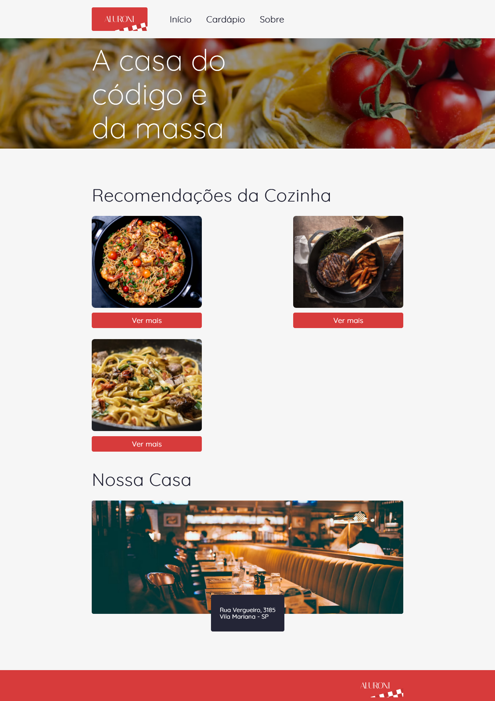

# React-Aluroni

## Sobre

Este é um repositório de estudos feito seguindo curso de React da Alura.




> Projeto de aplicação web para restaurante feita com single page application em react e utilizando React router dom, ESLint e mais.


## 💻 Pré-requisitos

Antes de começar, verifique se você atendeu aos seguintes requisitos:

* Você instalou a versão mais recente de  `<Node.JS versão LTS neste momento 18.12.1>` `<npm ou yarn>`
* Você tem uma máquina `<Windows / Linux / Mac>`.

## 🚀 Instalando React-Aluroni

Para instalar o React-Aluroni, siga estas etapas:

Linux e macOS (via SSH):
```
git clone git@github.com:dawkk/React-Aluroni.git
```

Windows:
```
git clone https://github.com/dawkk/React-Aluroni.git
```
<br/>
OU entre no repositório e clique em '<>Code' e em 'Download ZIP':
<br/>

## ☕ Usando React-Aluroni

Para usar React-Aluroni, siga estas etapas:

1. Após clonar ou baixar o repositório abra o projeto com sua IDE escolhida
2. Abra o terminal da IDE e instale as dependencias requisitadas
```
$ npm install
```
3. Entre na pasta aluroni conforme exemplo no sistema operacional Linux abaixo
```
$ cd aluroni
```
4. Execute o projeto
```
$ npm start
```

## 📫 Contribuindo para React-Aluroni
Para contribuir com React-Aluroni, siga estas etapas:

1. Bifurque este repositório.
2. Crie um branch: `git checkout -b <nome_branch>`.
3. Faça suas alterações e confirme-as: `git commit -m '<mensagem_commit>'`
4. Envie para o branch original: `git push origin React-Aluroni / <local>`
5. Crie a solicitação de pull.

Como alternativa, consulte a documentação do GitHub em [como criar uma solicitação pull](https://help.github.com/en/github/collaborating-with-issues-and-pull-requests/creating-a-pull-request).


## 📝 Licença

Esse projeto está sob licença. Veja o arquivo [LICENÇA](LICENSE.md) para mais detalhes.

[⬆ Voltar ao topo](#nome-do-projeto)<br>